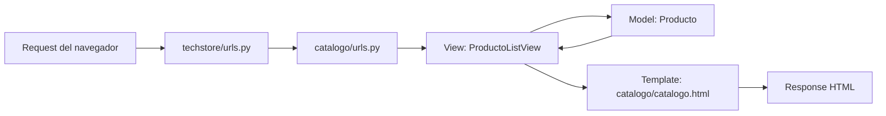

## Instrucciones

1. **Habilitar el entorno virtual:**

```bash
    python -m venv .venv
```

2. **Acceder al entorno virtual:**

- **Windows**
```bash
   venv\Scripts\activate
```

- **Linux / MacOS**

```bash
   source venv/bin/activate
```

3. **Descargar dependencias**

```python
    pip install -r requirements.txt
```

## Arquitectura MTV

El proyecto usa el patrón **MTV** de Django: el navegador envía una petición, Django resuelve la URL, ejecuta una vista, consulta el modelo si corresponde, renderiza un template y devuelve una respuesta HTTP.



Flujo para `/catalogo/`:

1. `Request`: el usuario entra a `/catalogo/`.
2. `URLs`: `techstore/urls.py` incluye las rutas de `catalogo.urls`; luego `catalogo/urls.py` dirige `catalogo/` a `ProductoListView`.
3. `View`: `ProductoListView` prepara el contexto con productos, categorías y la categoría activa.
4. `Model`: la vista consulta `Producto` para obtener productos disponibles.
5. `Template`: `catalogo/templates/catalogo/catalogo.html` recorre `productos` y renderiza las tarjetas.
6. `Response`: Django devuelve el HTML renderizado al navegador.

## QuerySets utilizados

1. Productos disponibles en el home:

```python
Producto.objects.filter(disponible=True).count()
```

Este QuerySet se usa en `home` para contar los productos disponibles. La consulta se ejecuta cuando se llama a `.count()`, porque Django necesita pedirle a la base de datos el total.

2. Catálogo filtrado y ordenado:

```python
qs = Producto.objects.filter(disponible=True).order_by('-fecha_agregado')
categoria = self.request.GET.get('categoria')
if categoria:
    qs = qs.filter(categoria=categoria)
```

Este QuerySet se usa en `ProductoListView.get_queryset()`. Primero arma una consulta con productos disponibles ordenados por fecha y, si llega el parámetro `?categoria=`, agrega un filtro adicional.

### Lazy evaluation

Los QuerySets en Django usan **lazy evaluation**: construir un QuerySet no ejecuta inmediatamente una consulta SQL. Django espera hasta que realmente necesita los datos, por ejemplo al iterar los productos en el template, convertirlos a lista, llamar a `.count()`, evaluar su longitud o acceder a sus resultados. Esto permite encadenar filtros como `.filter().order_by().filter()` antes de tocar la base de datos.

## Capturas

### `/catalogo/` renderizado


### Estructura de carpetas


Estructura principal del proyecto:

```text
repo_practica11_01/
├── manage.py
├── requirements.txt
├── README.md
├── catalogo/
│   ├── admin.py
│   ├── apps.py
│   ├── forms.py
│   ├── models.py
│   ├── tests.py
│   ├── urls.py
│   ├── views.py
│   ├── migrations/
│   │   └── 0001_initial.py
│   └── templates/
│       └── catalogo/
│           ├── agregar_producto.html
│           ├── base.html
│           ├── catalogo.html
│           └── home.html
└── techstore/
    ├── asgi.py
    ├── settings.py
    ├── urls.py
    └── wsgi.py
```


## Integrantes
- Alarcón Mendoza Estiven Rodrigo
- Calderón Leiva Anna Olenka
- Cruz Cruz Alexander Jhon
- Espíritu Díaz Olayne Guadalupe María Isabel
- Llanos Lozano Ricardo Alexander
- Martínez Casas Cristhian Emilio